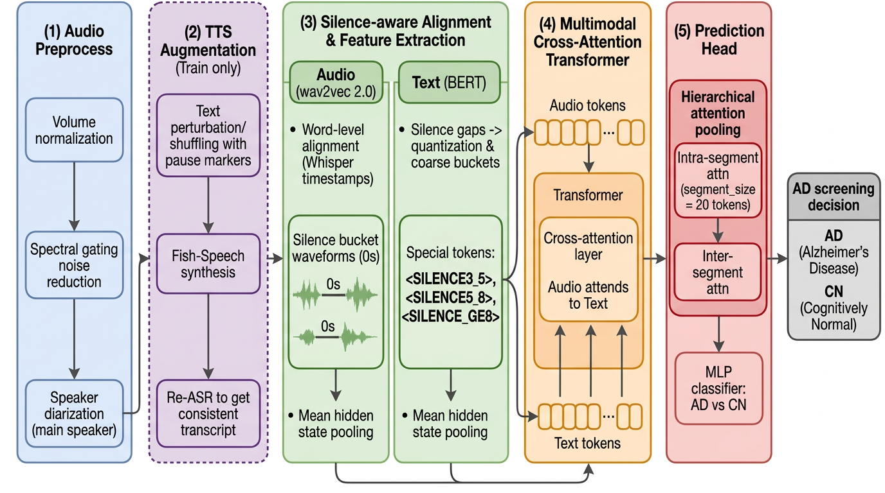

# STGM: Silence & TTS-Guided Multimodal Augmentation

STGM (Silence & TTS-Guided Multimodal Augmentation) is a framework designed for Alzheimer's Disease (AD) diagnosis through the analysis of spontaneous speech. It addresses the data scarcity problem in clinical datasets by leveraging silence-aware text manipulation and Text-to-Speech (TTS) based multimodal data augmentation.



## Overview

The STGM framework implements a comprehensive pipeline for multimodal data augmentation and classification:

1.  **Audio Preprocessing**: Automatic speech segmentation and cropping to Participant (PAR) intervals, with optional speaker diarization.
2.  **Silence-Aware Text Manipulation**: Strategic shuffling of text based on pause markers to simulate cognitive impairment patterns.
3.  **Multimodal Augmentation**: Generation of synthetic speech using Fish Speech TTS, conditioned on reference audio and manipulated text.
4.  **Speech Recognition (Re-ASR)**: Transcription of augmented audio using Whisper to maintain alignment between acoustic and linguistic features.
5.  **Feature Extraction**: Extraction of deep acoustic features (wav2vec2) and linguistic features (BERT), followed by fine-grained audio-text alignment.
6.  **Multimodal Classification**: Training and evaluation of a multimodal fusion model for AD detection.

## 1) Fish Speech API Server (TTS Engine)

The pipeline calls the Fish Speech server at `http://127.0.0.1:8080` (endpoint: `/v1/tts`).

### 1.1 Download Fish Speech

If you do not have the local `fish-speech/` directory, clone it:

```powershell
git clone https://github.com/fishaudio/fish-speech.git "fish-speech"
```

If the directory already exists, you can skip this step.

### 1.2 Start `api_server`

1. Make sure the Fish Speech repo is available under `./fish-speech/`.
2. Start the API server from inside `fish-speech/`.

Example (adjust checkpoint paths if your layout differs):

```powershell
cd fish-speech

if (!(Test-Path .venv)) {
  python -m venv venv
}

.\venv\Scripts\python.exe -m tools.api_server `
  --listen 127.0.0.1:8080 `
  --llama-checkpoint-path checkpoints/openaudio-s1-mini `
  --decoder-checkpoint-path checkpoints/openaudio-s1-mini/codec.pth `
  --decoder-config-name modded_dac_vq `
  --device cuda `
  --compile
```

Notes:

- `--compile` can take some time on the first run.
- Ensure the server is reachable from this repository (127.0.0.1:8080).

## 2) Dataset

This project uses the **ADReSSo Challenge** dataset, which provides audio recordings of spontaneous speech from individuals with Alzheimer’s Disease (AD) and Healthy Controls (HC). The dataset does not include transcripts—we generate them automatically using the Whisper speech recognition model.

Due to privacy and ethical restrictions, the ADReSSo dataset is not publicly available. To access the dataset, you must request permission from the original organizers:

👉 [Official ADReSSo Challenge page](https://luzs.gitlab.io/adresso/)

### 2.1 Training/Validation inputs

Default CLI arguments in `pipeline.py` assume:

- `--audio_dir audio`
- `--data_dir data`

So you typically prepare:

```text
audio/
  ad/
    <subject_stem>.mp3 (or .wav)
  cn/
    <subject_stem>.mp3 (or .wav)

segmentation/
  ad/
    <subject_stem>.csv
  cn/
    <subject_stem>.csv
```

`<subject_stem>` must match between:

- The audio filename stem (e.g. `adrso024.wav` -> `adrso024`)
- The segmentation CSV filename stem

#### Segmentation CSV format (PAR intervals)

During preprocessing, the script crops audio to the rows where:

- `speaker` column equals `PAR`
- `begin` and `end` columns are timestamps in **milliseconds**

If the segmentation file is missing or has no `PAR` intervals, the script falls back to using the full audio.

### 2.2 Test inputs (test-dist)

Default CLI arguments in `pipeline.py` assume:

- `--test_audio_dir test-dist/audio`
- `--test_ground_truth_csv test-dist/task1.csv`

Prepare:

```text
test-dist/
  audio/
    <subject_id>.<mp3|wav>
  task1.csv
  segmentation/
    <audio_stem>.csv
```

Where:

- `<subject_id>` must match the `ID` column in `test-dist/task1.csv`
- `<audio_stem>` is the filename stem of the audio under `test-dist/audio/`
  - Example: `12345.wav` -> segmentation CSV must be `test-dist/segmentation/12345.csv`

#### Ground-truth CSV format (`task1.csv`)

`pipeline.py` copies test audios into:

- `test-dist/test/ad/`
- `test-dist/test/cn/`

based on `Dx`:

- `Dx == "ProbableAD"` -> `ad`
- `Dx == "Control"` -> `cn`

It expects columns:

- `ID`
- `Dx`

### 2.3 Test segmentation CSV format

The preprocessing for `--split test` uses:

- `test-dist/segmentation/<audio_stem>.csv`

The CSV must again contain `speaker`, `begin`, `end` where `speaker == PAR` indicates intervals to crop.

## 3) Running the Pipeline

### 3.1 Start order

1. Start Fish Speech `api_server` (Section 1)
2. Run this repository’s pipeline (`pipeline.py`)

### 3.2 Training + test evaluation

Example (multimodal, with Fish Speech augmentation):

```powershell
python pipeline.py `
  --audio_dir audio `
  --data_dir data `
  --language en `
  --num_references 5 `
  --num_augmentations 1 `
  --mode multimodal `
  --test_audio_dir test-dist/audio `
  --test_ground_truth_csv test-dist/task1.csv
```

Common flags:

- `--skip`: skip pipeline steps (split/preprocess/references/shuffle/tts/reasr/extract_features/train/test)
- `--hf_token`: optional Hugging Face token for diarization models
- `--n_folds`: if set (e.g. `5`), run 5-fold CV